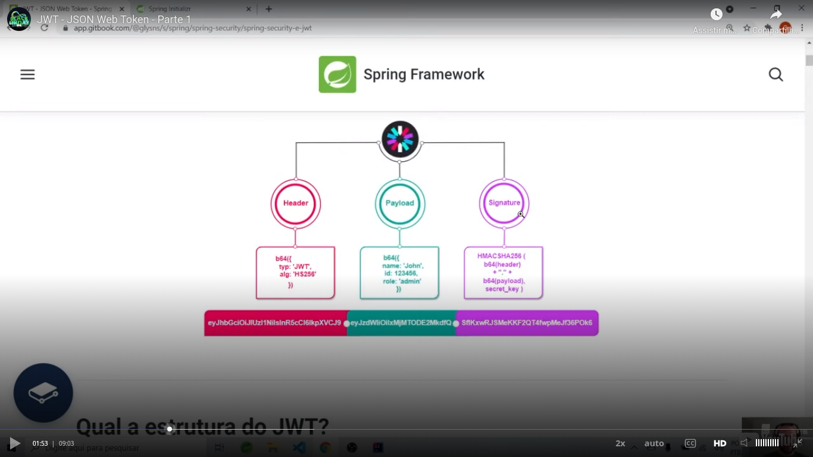
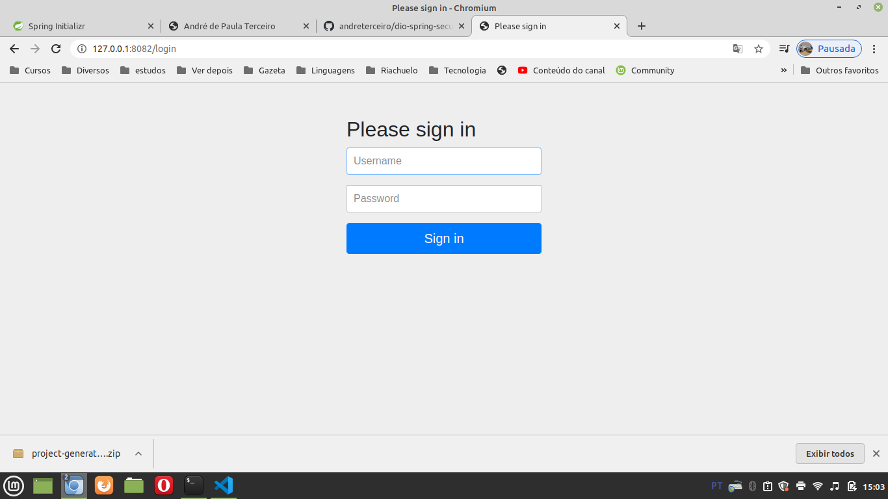

# General

Initial [class link](https://web.dio.me/course/adicionando-seguranca-a-uma-api-rest-com-spring-security/learning/cfc7d590-9a2d-4643-bdaf-171ad5265cc4?back=/track/coding-the-future-claro-java-spring-boot&tab=undefined&moduleId=undefined).


## General DIO repository

[Link](https://github.com/digitalinnovationone/dio-springboot)


## Introduction

JWT = **`J`SON** `W`eb `T`oken. Pay attention: **JSON**.

Introduction / summary of JWT:



Related to the content of the `header` and the `payload` you cam see this examples:


## Basic project

I generated the project of the zip file `project-generated-with-initializr.zip` (that is in the root directory), extracted the bolierplate in the root directory and created the file `application.properties` with this content:

```
server.port=8082
```

When accessing the basic application, I saw this page:




## JWT dependency

I added a dependency related to JWT this way under depenencies in `pom.xml`:

```
		<!-- JWT -->
		<dependency>
			<groupId>io.jsonwebtoken</groupId>
			<artifactId>jjwt</artifactId>
			<version>0.7.0</version>
		</dependency>	
```

Pay attention that artifactId is "jjwt".


## DAO x DTO x Repository

Teacher showed us a slide with the packages `DTO` and `repository` and I conclude that I need to undersand better this concepts. Making questions to ChatGPT, the answer was:

**Question:** explique e diferencie os conceitos de DTO, DAO e repository
```
Claro! Vamos entender cada um desses conceitos e como eles se diferenciam:

### 1. DTO (Data Transfer Object)
- **Definição**: Um DTO é um objeto usado para transferir dados entre diferentes partes de um sistema, como entre a camada de apresentação e a camada de negócios ou entre serviços.
- **Função**: Facilita a comunicação de dados, agrupando informações que precisam ser enviadas em uma única estrutura. Isso ajuda a reduzir o número de chamadas e a melhorar a eficiência.
- **Exemplo**: Um objeto que contém informações de um usuário (nome, email, idade) que é enviado de uma API para um cliente.

### 2. DAO (Data Access Object)
- **Definição**: Um DAO é um padrão de design que fornece uma interface para acessar dados de uma fonte, como um banco de dados. Ele encapsula a lógica de acesso a dados.
- **Função**: Separa a lógica de negócios da lógica de acesso a dados, permitindo que a aplicação trabalhe com dados de forma mais abstraída. O DAO realiza operações como CRUD (Create, Read, Update, Delete).
- **Exemplo**: Uma classe `UserDao` que contém métodos como `getUserById`, `saveUser`, etc., que se conectam ao banco de dados.

### 3. Repository
- **Definição**: O padrão Repository também fornece uma abstração sobre a camada de acesso a dados, mas geralmente é mais focado em um contexto de domínio específico, trabalhando com entidades de domínio.
- **Função**: Permite que a lógica de negócios interaja com a fonte de dados através de uma coleção de objetos, oferecendo uma interface mais rica que pode incluir lógica de negócios associada à persistência.
- **Exemplo**: Uma classe `UserRepository` que fornece métodos como `findByEmail`, `remove`, que podem incluir regras específicas relacionadas ao gerenciamento de usuários.

### Diferenças:
- **Foco**: 
  - DTO se preocupa com a transferência de dados.
  - DAO foca no acesso direto aos dados.
  - Repository se concentra em fornecer uma interface mais rica para a manipulação de entidades de domínio.
  
- **Uso**:
  - DTO é utilizado para transferir dados entre diferentes camadas.
  - DAO é usado para executar operações de acesso a dados.
  - Repository é utilizado para interagir com conjuntos de dados em um contexto de domínio específico.

Esses padrões podem ser usados em conjunto em uma aplicação, dependendo da arquitetura e das necessidades específicas do projeto.
```

**Question:** DAO e repository servem para a mesma coisa?

```
DAO (Data Access Object) e Repository são conceitos que têm algumas semelhanças, mas não são exatamente a mesma coisa. Vamos explorar as principais diferenças e semelhanças:

### Semelhanças:
- **Abstração de Acesso a Dados**: Ambos servem para abstrair a lógica de acesso a dados e ocultar os detalhes da implementação de como os dados são armazenados e recuperados.
- **Operações CRUD**: Tanto DAOs quanto Repositories geralmente incluem métodos para operações básicas de CRUD (Create, Read, Update, Delete).

### Diferenças:
1. **Enfoque e Contexto**:
   - **DAO**: Foca principalmente em como acessar dados de uma fonte específica, como um banco de dados. A ênfase está na conexão e nas operações diretas com a base de dados.
   - **Repository**: Foca mais no modelo de domínio e na lógica de negócios. Um Repository pode incluir lógica que manipula as entidades antes ou depois de acessá-las.

2. **Modelo de Domínio**:
   - **DAO**: Não necessariamente trabalha com um modelo de domínio. Pode lidar com dados de forma mais "plana" ou técnica.
   - **Repository**: Trabalha diretamente com entidades do modelo de domínio, o que significa que pode aplicar regras de negócios e lógica específica.

3. **Interface**:
   - **DAO**: Geralmente oferece uma interface simples com métodos de acesso a dados.
   - **Repository**: Pode oferecer uma interface mais rica, que reflete operações mais complexas e específicas do domínio.

### Resumo:
Embora DAO e Repository possam ser usados para propósitos semelhantes (acesso a dados), o Repository é geralmente mais orientado ao domínio e à lógica de negócios, enquanto o DAO é mais técnico e se concentra na implementação do acesso a dados. Em muitos casos, eles podem coexistir em uma aplicação, com o DAO lidando com a persistência e o Repository servindo como uma camada de abstração adicional.
```

I read this [interesting Stackoverflow post](https://pt.stackoverflow.com/questions/22444/o-que-%C3%A9-e-para-que-serve-um-java-bean) talking about beans.

For this class User:

´´´
package dio.dio.spring.security.jwt.model;

import jakarta.persistence.*;
import java.util.ArrayList;
import java.util.List;

@Entity
@Table(name = "tab_user")
public class User {
    @Id
    @GeneratedValue(strategy = GenerationType.IDENTITY)
    @Column(name = "id_user")
    private Integer id;
    @Column(length = 50, nullable = false)
    private String name;
    @Column(length = 20, nullable = false)
    private String username;
    @Column(length = 100, nullable = false)
    private String password;
    @ElementCollection(fetch = FetchType.EAGER)
    @CollectionTable(name = "tab_user_roles", joinColumns = @JoinColumn(name = "user_id"))
    @Column(name = "role_id")
    private List<String> roles = new ArrayList<>();

    public Integer getId() {
        return id;
    }

    public void setId(Integer id) {
        this.id = id;
    }

    public String getName() {
        return name;
    }

    public void setName(String name) {
        this.name = name;
    }

    public String getUsername() {
        return username;
    }

    public void setUsername(String username) {
        this.username = username;
    }

    public String getPassword() {
        return password;
    }

    public void setPassword(String password) {
        this.password = password;
    }

    public List<String> getRoles() {
        return roles;
    }

    public void setRoles(List<String> roles) {
        this.roles = roles;
    }
}
´´´

I have to complete with this import:

```
import jakarta.persistence.*;
```

Because now this line replaces the import:

```
import javax.persistence.*;
```

You can easily find more information searching in the Internet.