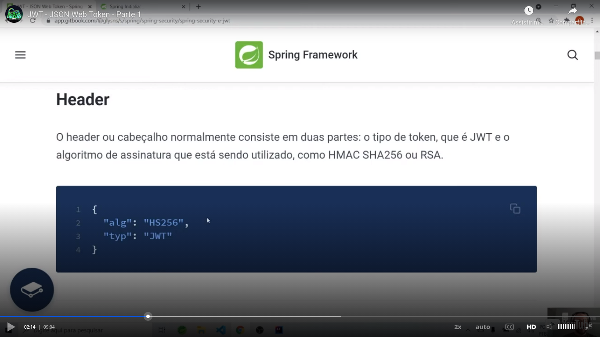

# General

Initial [class link](https://web.dio.me/course/adicionando-seguranca-a-uma-api-rest-com-spring-security/learning/cfc7d590-9a2d-4643-bdaf-171ad5265cc4?back=/track/coding-the-future-claro-java-spring-boot&tab=undefined&moduleId=undefined).


## General DIO repository

[Link](https://github.com/digitalinnovationone/dio-springboot)


## Introduction

JWT = **`J`SON** `W`eb `T`oken. Pay attention: **JSON**.

Introduction / summary of JWT:


Related to the content of the `header` and the `payload` you cam see this examples:




## Basic project

I generated the project of the zip file `project-generated-with-initializr.zip` (that is in the root directory), extracted the bolierplate in the root directory and created the file `application.properties` with this content:

```
server.port=8082
```

When accessing the basic application, I saw this page:

