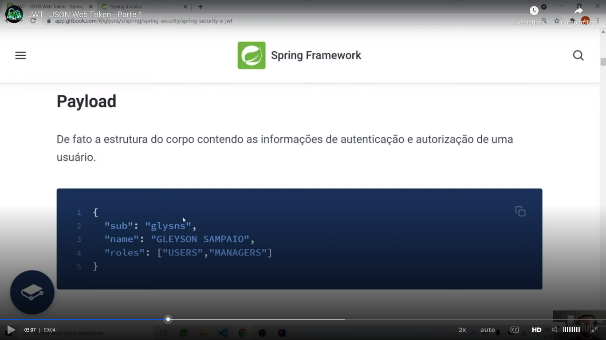

# General

Initial [class link](https://web.dio.me/course/adicionando-seguranca-a-uma-api-rest-com-spring-security/learning/cfc7d590-9a2d-4643-bdaf-171ad5265cc4?back=/track/coding-the-future-claro-java-spring-boot&tab=undefined&moduleId=undefined).


## General DIO repository

[Link](https://github.com/digitalinnovationone/dio-springboot)


## Introduction

JWT = **`J`SON** `W`eb `T`oken. Pay attention: **JSON**.

Introduction / summary of JWT:


Related to the content of the `header` and the `payload` you cam see this examples:





## Basic project

I generated the project of the zip file `project-generated-with-initializr.zip` (that is in the root directory), extracted the bolierplate in the root directory and created the file `application.properties` with this content:

```
server.port=8082
```

When accessing the basic application, I saw this page:


## JWT dependency

I added a dependency related to JWT this way under depenencies in `pom.xml`:

```
		<!-- JWT -->
		<dependency>
			<groupId>io.jsonwebtoken</groupId>
			<artifactId>jjwt</artifactId>
			<version>0.7.0</version>
		</dependency>	
```

Pay attention that artifactId is "jjwt".


## DAO x DTO x Repository

Teacher showed us a slide with the packages `DTO` and `repository` and I conclude that I need to undersand better this concepts. Making questions to ChatGPT, the answer was:

**Question:** explique e diferencie os conceitos de DTO, DAO e repository
```
Claro! Vamos entender cada um desses conceitos e como eles se diferenciam:

### 1. DTO (Data Transfer Object)
- **Definição**: Um DTO é um objeto usado para transferir dados entre diferentes partes de um sistema, como entre a camada de apresentação e a camada de negócios ou entre serviços.
- **Função**: Facilita a comunicação de dados, agrupando informações que precisam ser enviadas em uma única estrutura. Isso ajuda a reduzir o número de chamadas e a melhorar a eficiência.
- **Exemplo**: Um objeto que contém informações de um usuário (nome, email, idade) que é enviado de uma API para um cliente.

### 2. DAO (Data Access Object)
- **Definição**: Um DAO é um padrão de design que fornece uma interface para acessar dados de uma fonte, como um banco de dados. Ele encapsula a lógica de acesso a dados.
- **Função**: Separa a lógica de negócios da lógica de acesso a dados, permitindo que a aplicação trabalhe com dados de forma mais abstraída. O DAO realiza operações como CRUD (Create, Read, Update, Delete).
- **Exemplo**: Uma classe `UserDao` que contém métodos como `getUserById`, `saveUser`, etc., que se conectam ao banco de dados.

### 3. Repository
- **Definição**: O padrão Repository também fornece uma abstração sobre a camada de acesso a dados, mas geralmente é mais focado em um contexto de domínio específico, trabalhando com entidades de domínio.
- **Função**: Permite que a lógica de negócios interaja com a fonte de dados através de uma coleção de objetos, oferecendo uma interface mais rica que pode incluir lógica de negócios associada à persistência.
- **Exemplo**: Uma classe `UserRepository` que fornece métodos como `findByEmail`, `remove`, que podem incluir regras específicas relacionadas ao gerenciamento de usuários.

### Diferenças:
- **Foco**: 
  - DTO se preocupa com a transferência de dados.
  - DAO foca no acesso direto aos dados.
  - Repository se concentra em fornecer uma interface mais rica para a manipulação de entidades de domínio.
  
- **Uso**:
  - DTO é utilizado para transferir dados entre diferentes camadas.
  - DAO é usado para executar operações de acesso a dados.
  - Repository é utilizado para interagir com conjuntos de dados em um contexto de domínio específico.

Esses padrões podem ser usados em conjunto em uma aplicação, dependendo da arquitetura e das necessidades específicas do projeto.
```

**Question:** DAO e repository servem para a mesma coisa?

```
DAO (Data Access Object) e Repository são conceitos que têm algumas semelhanças, mas não são exatamente a mesma coisa. Vamos explorar as principais diferenças e semelhanças:

### Semelhanças:
- **Abstração de Acesso a Dados**: Ambos servem para abstrair a lógica de acesso a dados e ocultar os detalhes da implementação de como os dados são armazenados e recuperados.
- **Operações CRUD**: Tanto DAOs quanto Repositories geralmente incluem métodos para operações básicas de CRUD (Create, Read, Update, Delete).

### Diferenças:
1. **Enfoque e Contexto**:
   - **DAO**: Foca principalmente em como acessar dados de uma fonte específica, como um banco de dados. A ênfase está na conexão e nas operações diretas com a base de dados.
   - **Repository**: Foca mais no modelo de domínio e na lógica de negócios. Um Repository pode incluir lógica que manipula as entidades antes ou depois de acessá-las.

2. **Modelo de Domínio**:
   - **DAO**: Não necessariamente trabalha com um modelo de domínio. Pode lidar com dados de forma mais "plana" ou técnica.
   - **Repository**: Trabalha diretamente com entidades do modelo de domínio, o que significa que pode aplicar regras de negócios e lógica específica.

3. **Interface**:
   - **DAO**: Geralmente oferece uma interface simples com métodos de acesso a dados.
   - **Repository**: Pode oferecer uma interface mais rica, que reflete operações mais complexas e específicas do domínio.

### Resumo:
Embora DAO e Repository possam ser usados para propósitos semelhantes (acesso a dados), o Repository é geralmente mais orientado ao domínio e à lógica de negócios, enquanto o DAO é mais técnico e se concentra na implementação do acesso a dados. Em muitos casos, eles podem coexistir em uma aplicação, com o DAO lidando com a persistência e o Repository servindo como uma camada de abstração adicional.
```

I read this [interesting Stackoverflow post](https://pt.stackoverflow.com/questions/22444/o-que-%C3%A9-e-para-que-serve-um-java-bean) talking about beans.

For this class User:

´´´
package dio.dio.spring.security.jwt.model;

import jakarta.persistence.*;
import java.util.ArrayList;
import java.util.List;

@Entity
@Table(name = "tab_user")
public class User {
    @Id
    @GeneratedValue(strategy = GenerationType.IDENTITY)
    @Column(name = "id_user")
    private Integer id;
    @Column(length = 50, nullable = false)
    private String name;
    @Column(length = 20, nullable = false)
    private String username;
    @Column(length = 100, nullable = false)
    private String password;
    @ElementCollection(fetch = FetchType.EAGER)
    @CollectionTable(name = "tab_user_roles", joinColumns = @JoinColumn(name = "user_id"))
    @Column(name = "role_id")
    private List<String> roles = new ArrayList<>();

    public Integer getId() {
        return id;
    }

    public void setId(Integer id) {
        this.id = id;
    }

    public String getName() {
        return name;
    }

    public void setName(String name) {
        this.name = name;
    }

    public String getUsername() {
        return username;
    }

    public void setUsername(String username) {
        this.username = username;
    }

    public String getPassword() {
        return password;
    }

    public void setPassword(String password) {
        this.password = password;
    }

    public List<String> getRoles() {
        return roles;
    }

    public void setRoles(List<String> roles) {
        this.roles = roles;
    }
}
´´´

I have to complete with this import:

```
import jakarta.persistence.*;
```

Because now this line replaces the import:

```
import javax.persistence.*;
```

You can easily find more information searching in the Internet.

One important question: when I added (as techer teached) a repository, I added an interface and not a class.

Until now I created a `model`, a `repository` and a `service`. Please see the classes under the folder `src`. Comments:
-  The `model` User have characteristics of a `bean`, like having `getters` and `setters`. Have some annotations related to databse constraints, but a model is have not the main propouse of connect to a database. Besides other annotations, have the annotations '@Entity' and
'@Table(name = "tab_user")'. Have an annotation to specify that a value is a generated value;
- The `repository` UserRepository have the objective of connect to a database. In the example of this project is an interface that extends JPARepository<User, Integer> (format of the generics: <Model, type of id field>). Uses the model `User`, but this class is not autowired (nor instantiated). Remeber, this file is an **interface**. Do not have a special annotation, but, again, is an **interface** that extends `JPARepository`; 
- The `service` UserService uses the UserRepository (autowired). Its main objective is to encrypt the password and its uses the `repository` to make the persistence. Have the annotation `@Service`.

UserController:

- have the annotation "@RestController";
- have the annotation "@RequestMapping(/users/)"
- have the UserService `autowired`;
- have the annotation `@PostMapping` in one method.

A `JWT` token (mapped to an object) **in the header of the request** will deal with the authentication. We do this in the next steps.

Now we created the class JWTObject in the secutiry package. This class do not have any annotations. This class is related to the conversion `token` to `object` and `object` to `token`.

Then we created the class SecurityConfig object also in the security package. This class reads configurations from `application.properties`, not configurations about a specific token, but configurations related to the encrypt process. It does not uses directly the JWTObject class and have the annotations:

- @Configuration
- @ConfigurationProperties(prefix = "security.config")

Now we inserted this informations in `application.properties`:

```
security.config.prefix=Bearer
security.config.key=SECRET_KEY
security.config.expiration=3600000
```

Please see the mapping the prefix `security.config` to the annotation - `@ConfigurationProperties(prefix = "security.config")`

You can change this line to have a token relatedd to your application:

```
security.config.key=SECRET_KEY
```

Then we created the service JWTCreator class, who deals with the token creation based on an object or get the token created on a previous momment, convert it on an object and validated it. It class deals with the interaction of the Spring Security and the JWT mechanism.

Then we created the class JWTFilter under the security package. In this class I had to change the imports with the `javax` prefix to the `jakarta` prefix. now we have this imports:

```
import jakarta.servlet.FilterChain;
import jakarta.servlet.ServletException;
import jakarta.servlet.http.HttpServletRequest;
import jakarta.servlet.http.HttpServletResponse;
```

This import verifies the integrity of the token on **every** request. it intercepts the request data, validates the token and generated the `JWTObject`. Then if its all "ok", it creates an object of the type `UsernamePasswordAuthenticationToken` and adds it to the context. In case of a problem, an exception is thrown.

Some problems ocurred when creating the `WebSecurityConfig.java` class under the `security` package. Please see what I did trying to solve the problem:

[Video about I am trying to solve some problems in the project](https://youtu.be/lh1DpzejopQ)

I ercord this [another video](https://youtu.be/3OHM_7OLfvI) about trying to solve the problem. As I do not solved the problem, I will not test the final solution.

About switching Java versions: [link](https://askubuntu.com/questions/740757/switch-between-multiple-java-versions)

In the rest of the class teacher removed an tag relating to runtime and H2 database and commented some things of the `WebSecurityConfig`, as example:

- He commented that this annotation is related to the class be related to the cryptography process. I understood that `@Configuration` is not related only to cryptography thins, but I unerstood the whole idea.

```
@Configuration
@EnableWebSecurity
```

- He commented that here we enabled the cryptography class:

```
    @Bean
    public BCryptPasswordEncoder encoder(){
        return new BCryptPasswordEncoder();
    }
```

- And that here we created a whitelist of routes be used by Swagger:

```
    private static final String[] SWAGGER_WHITELIST = {
            "/v2/api-docs",
            "/swagger-resources",
            "/swagger-resources/**",
            "/configuration/ui",
            "/configuration/security",
            "/swagger-ui.html",
            "/webjars/**"
    };
```

And here we configure the roles (or not if a rout is public) related to the resources allowed to access:

```
    @Override
    protected void configure(HttpSecurity http) throws Exception {
        http.headers().frameOptions().disable();
        http.cors().and().csrf().disable()
                .addFilterAfter(new JWTFilter(), UsernamePasswordAuthenticationFilter.class)
                .authorizeRequests()
                .antMatchers(SWAGGER_WHITELIST).permitAll()
                .antMatchers("/h2-console/**").permitAll()
                .antMatchers(HttpMethod.POST,"/login").permitAll()
                .antMatchers(HttpMethod.POST,"/users").permitAll()
                .antMatchers(HttpMethod.GET,"/users").hasAnyRole("USERS","MANAGERS")
                .antMatchers("/managers").hasAnyRole("MANAGERS")
                .anyRequest().authenticated()
                .and()
                .sessionManagement().sessionCreationPolicy(SessionCreationPolicy.STATELESS);
    }
```